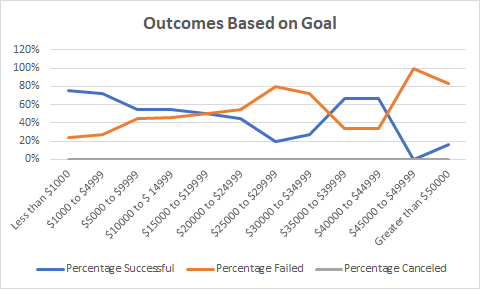
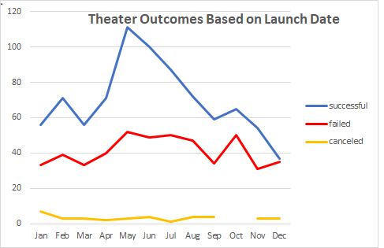

# Kickstarting with Excel

## Overview of Project
Analyzing datapoints related to crowdfunding to help Louise understand why certain projects were or were not successful in order to help increase the number
of productions that reach success.
### Purpose
Louise has chosen to concentrate on the smalleter dataset of plays.
# kickstarter-analysis
# Kickstarting with Excel

## Overview of Project
Analyzing datapoints related to crowdfunding to help Louise understand why certain projects were or were not successful in order to help increase the number
of productions that reach success.
### Purpose
Louise has chosen to concentrate on the smalleter dataset of plays.
She has seen examples of plays that were successful in fundraising in short amount of time and wants to understand better what is driving this.
Louise now wants to know how different campaigns fared in relation to 
their launch dates and their funding goals. 

We will help Louise visualize campaign outcomes based on 
their launch dates and their funding goals.
## Analysis and Challenges

### Analysis of Outcomes Based on Launch Date
First using the Kickstarter spreasheet I created a new column utilizing the excel YEARS function in order to be able to identify later in process the month of the launch. 
I then created a pivot table labeled Theater Outcomes by Launch Date with a filter on Parent Category, in order to get Theatre info only, and Years, in order to get the month of launch. 

### Analysis of Outcomes Based on Goals
For the second section, 
* I used excel and created a new worksheet, Outcomes Based on Goals. 
* Using the percentage of: successful, failed, and canceled plays and based on the funding goal amount I populated the worksheet using: 
1. a new function, COUNTIFS, as well as some 
2. calcs for percentage for which I had to properly format the field to show percent 
3. the basic SUM function for summarizing rows.

### Challenges and Difficulties Encountered
I had a bit of a challenge with the Rose Labels column but the helpful hint solved that.  Because there was plenty of helpful steps in thes first section, it was somewhat easy to 
navigate through.

There were a few more challenges here because there were not as many directions provided as in the first, I struggled a bit but was able to review some modules or use google to help me through. 
## Results

- What are two conclusions you can draw about the Outcomes based on Launch Date?
1. Plays that were launched in early Spring or Summer (April through August) had a higher success rate then other months, although there was a slight spike in October and February.
2. Winter months or holiday season, does not appear to be a good time to launch a play.  
- What can you conclude about the Outcomes based on Goals?
As the amount of the goal increases, the number of successes decreases.  Therefore, there are more successful plays when funding goals stay under $10,000, with the best goal range 
being $1000 to $4999 where there was 388 successes! 

- What are some limitations of this dataset?
Could have looked a little closer at the country or location, which can impact weather.
Did not look at content vs launch data

- What are some other possible tables and/or graphs that we could create?
Could create charts comparing start and end dates to see if amount of time between launch and end date has any impact.  Additionally could graph 
location 
